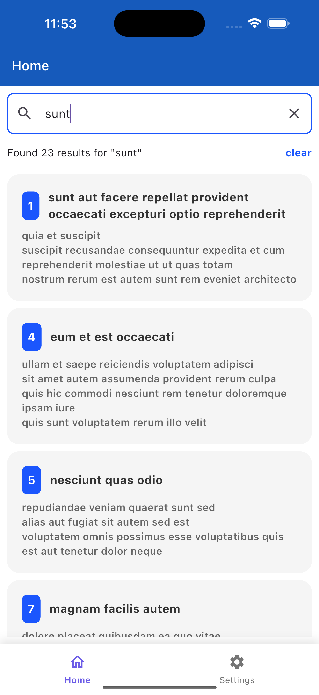
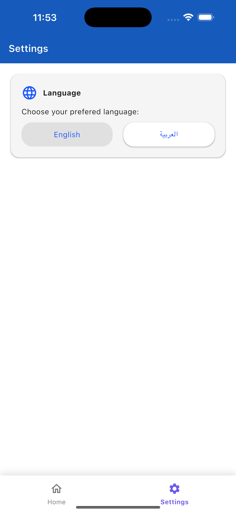

# Posts App

A Flutter application that displays posts from JSONPlaceholder API with search functionality and multilingual support (English & Arabic). Built using BLoC state management and clean architecture principles.

## ✨ Features
🏠 Home Page: Displays posts in a card-based layout with search functionality

⚙️ Settings Page: Language switching between English and Arabic

🔄 State Management: BLoC pattern for efficient state handling

🌐 Localization: Internationalization support using flutter_localizations

🔍 Search: Real-time filtering of posts with search term

📲 Pull-to-Refresh: Refresh functionality to reload posts

🚨 Error Handling: Graceful handling of API errors and empty states


## 🛠️ Technical Implementation
## Architecture
- The app follows Clean Architecture with these layers:

- Data Layer: API calls, repositories implementation

- Domain Layer: Business logic, entities, repositories interfaces

- Presentation Layer: UI components, BLoCs, pages

## State Management
- BLoC pattern for managing application state

- Separate BLoCs for posts and language settings

- Cubit for simpler state management where appropriate


## API Integration
- Uses http package for API calls

- JSONPlaceholder API for posts data

- Error handling for network issues

## Localization
- flutter_localizations package for i18n

- Support for English (LTR) and Arabic (RTL)

- Automatic text direction switching

## 📁 Project Structure
```lib/
├── core/
│   ├── constants/
│   │   ├── app_colors.dart
│   │   ├── app_strings.dart
│   │   ├── constants.dart
│   │   └── endpoints.dart
│   ├── errors/
│   │   ├── exceptions.dart
│   │   ├── failures.dart
│   │   └── server_failure.dart
│   ├── network/
│   │   ├── network_info.dart
│   │   └── remote_data_source.dart
│   ├── usecases/
│   │   └── usecase.dart
│   └── utils/
│       ├── input_validator.dart
│       ├── platform_info.dart
│       └── text_styles.dart
├── features/
│   ├── posts/
│   │   ├── data/
│   │   │   ├── datasources/
│   │   │   │   ├── post_local_data_source.dart
│   │   │   │   └── post_remote_data_source.dart
│   │   │   └── repositories/
│   │   │       └── post_repository_impl.dart
│   │   ├── domain/
│   │   │   ├── entities/
│   │   │   │   └── post_entity.dart
│   │   │   ├── repositories/
│   │   │   │   └── post_repository.dart
│   │   │   └── usecases/
│   │   │       ├── get_post.dart
│   │   │       ├── get_posts.dart
│   │   │       └── search_posts.dart
│   │   └── presentation/
│   │       ├── bloc/
│   │       │   ├── post_bloc.dart
│   │       │   ├── post_event.dart
│   │       │   └── post_state.dart
│   │       ├── pages/
│   │       │   ├── home_page.dart
│   │       │   ├── post_detail_page.dart
│   │       │   └── posts_list_page.dart
│   │       └── widgets/
│   │           ├── post_card.dart
│   │           ├── post_list_item.dart
│   │           └── search_bar.dart
│   └── settings/
│       └── presentation/
│           ├── bloc/
│           │   ├── language_bloc.dart
│           │   ├── language_event.dart
│           │   └── language_state.dart
│           └── pages/
│               └── settings_page.dart
├── injection_container.dart
├── main.dart
└── app.dart
```

## 🚀 Setup Instructions
1- Clone the repository:
```
git clone https://github.com/ShaimaaIbrahim/posts-repo.git
cd posts-repo
```
2- Install dependencies:
``` flutter pub get ```

3-Generate localization files:
 ``` flutter gen-l10n ```
 
4-Run the app:
``` flutter run ```


### 📦 Dependencies

flutter_bloc: ^8.1.3

equatable: ^2.0.5

http: ^0.13.6

get_it: ^7.6.4

flutter_localizations: SDK component

intl: Any version

## 🔧 Key Implementation Details

### Search Functionality
- Real-time filtering as user types

- Case-insensitive search
  
- Search results counter display

### Language Switching
- BLoC manages language state

- Application resources reload when language changes

- Search field clears on language change

### Data Persistence

- BLoC retains state when switching tabs

### Error Handling
- Network error messages

- Empty state UI for no posts or no search results

- Loading indicators during API calls

 ### Shots
 ### Home


### Settings



### 👩‍💻 Author
Shaimaa Ibrahim
GitHub Profile

### 📄 License
This project is open source and available under the MIT License.

